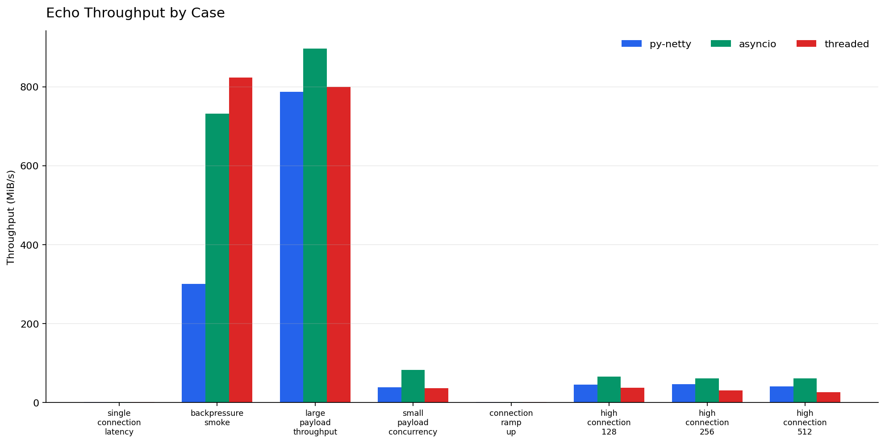
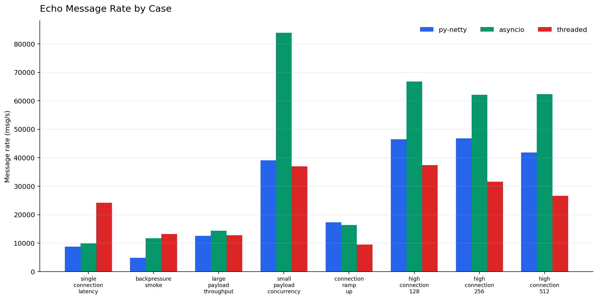
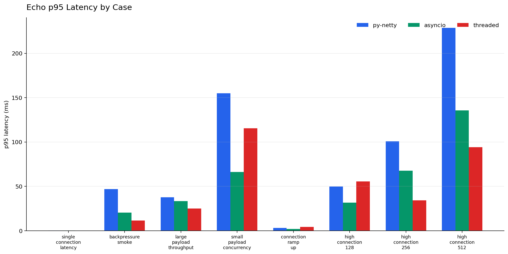
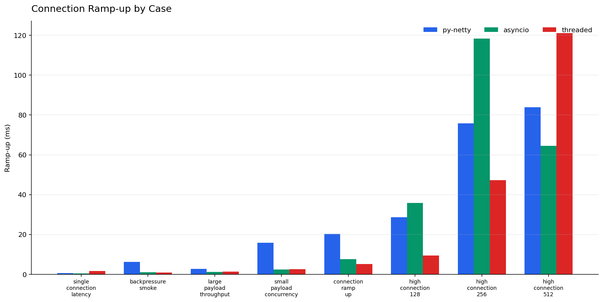

# py-netty :rocket:

[](https://github.com/ruanhao/py-netty/actions/workflows/ci.yml)
[](https://codecov.io/gh/ruanhao/py-netty)
[](https://pepy.tech/project/py-netty)

An event-driven TCP networking framework.

Ideas and concepts under the hood are built upon those of [Netty](https://netty.io/), especially the IO and executor model.

APIs are designed to feel familiar to Netty users.


# Features

- callback based application invocation
- non blocking IO
- recv/write is performed only in IO thread
- adaptive read buffer 
- low/higher water mark to indicate writability (default low water mark is 32K and high water mark is 64K)
- all platform supported (linux: epoll, mac: kqueue, windows: select)

## Installation

```bash
pip install py-netty
```

## Getting Started

Start an echo server:

```python
from py_netty import ServerBootstrap
ServerBootstrap().bind(address='0.0.0.0', port=8080).close_future().sync()
```

Start an echo server (TLS):

```python
from py_netty import ServerBootstrap
ServerBootstrap(certfile='/path/to/cert/file', keyfile='/path/to/key/file').bind(address='0.0.0.0', port=9443).close_future().sync()
```

As TCP client:

```python
from py_netty import Bootstrap, ChannelHandlerAdapter


class HttpHandler(ChannelHandlerAdapter):
    def channel_read(self, ctx, buffer):
        print(buffer.decode('utf-8'))
        

remote_address, remote_port = 'www.google.com', 80
b = Bootstrap(handler_initializer=HttpHandler)
channel = b.connect(remote_address, remote_port).sync().channel()
request = f'GET / HTTP/1.1\r\nHost: {remote_address}\r\n\r\n'
channel.write(request.encode('utf-8'))
input() # pause
channel.close()
```


As TCP client (TLS):

```python
from py_netty import Bootstrap, ChannelHandlerAdapter


class HttpHandler(ChannelHandlerAdapter):
    def channel_read(self, ctx, buffer):
        print(buffer.decode('utf-8'))
        

remote_address, remote_port = 'www.google.com', 443
b = Bootstrap(handler_initializer=HttpHandler, tls=True, verify=True)
channel = b.connect(remote_address, remote_port).sync().channel()
request = f'GET / HTTP/1.1\r\nHost: {remote_address}\r\n\r\n'
channel.write(request.encode('utf-8'))
input() # pause
channel.close()
```

TCP port forwarding:

```python
from py_netty import ServerBootstrap, Bootstrap, ChannelHandlerAdapter, EventLoopGroup


class ProxyChannelHandler(ChannelHandlerAdapter):

    def __init__(self, remote_host, remote_port, client_eventloop_group):
        self._remote_host = remote_host
        self._remote_port = remote_port
        self._client_eventloop_group = client_eventloop_group
        self._client = None

    def _client_channel(self, ctx0):

        class __ChannelHandler(ChannelHandlerAdapter):
            def channel_read(self, ctx, bytebuf):
                ctx0.write(bytebuf)

            def channel_inactive(self, ctx):
                ctx0.close()

        if self._client is None:
            self._client = Bootstrap(
                eventloop_group=self._client_eventloop_group,
                handler_initializer=__ChannelHandler
            ).connect(self._remote_host, self._remote_port).sync().channel()
        return self._client

    def exception_caught(self, ctx, exception):
        ctx.close()

    def channel_read(self, ctx, bytebuf):
        self._client_channel(ctx).write(bytebuf)

    def channel_inactive(self, ctx):
        if self._client:
            self._client.close()


proxied_server, proxied_port = 'www.google.com', 443
client_eventloop_group = EventLoopGroup(1, 'ClientEventloopGroup')
sb = ServerBootstrap(
    parent_group=EventLoopGroup(1, 'Acceptor'),
    child_group=EventLoopGroup(1, 'Worker'),
    child_handler_initializer=lambda: ProxyChannelHandler(proxied_server, proxied_port, client_eventloop_group)
)
sb.bind(port=8443).close_future().sync()
```

## Event-driven callbacks

Create handler with callbacks for interested events:

``` python
from py_netty import ChannelHandlerAdapter


class MyChannelHandler(ChannelHandlerAdapter):
    def channel_active(self, ctx: 'ChannelHandlerContext') -> None:
        # invoked when channel is active (TCP connection ready)
        pass

    def channel_read(self, ctx: 'ChannelHandlerContext', msg: Union[bytes, socket.socket]) -> None:
        # invoked when there is data ready to process
        pass

    def channel_inactive(self, ctx: 'ChannelHandlerContext') -> None:
        # invoked when channel is inactive (TCP connection is broken)
        pass

    def channel_registered(self, ctx: 'ChannelHandlerContext') -> None:
        # invoked when the channel is registered with a eventloop
        pass

    def channel_unregistered(self, ctx: 'ChannelHandlerContext') -> None:
        # invoked when the channel is unregistered from a eventloop
        pass

    def channel_handshake_complete(self, ctx: 'ChannelHandlerContext') -> None:
        # invoked when ssl handshake is complete, this only applies to client side
        pass

    def channel_writability_changed(self, ctx: 'ChannelHandlerContext') -> None:
        # invoked when pending data > high water mark or < low water mark
        pass

    def exception_caught(self, ctx: 'ChannelHandlerContext', exception: Exception) -> None:
        # invoked when there is any exception raised during process
        pass
```


## Benchmark

The current benchmark uses the local echo performance runner in
`integration_tests/perf_echo.py`. Each case starts an in-process localhost echo
server for the selected engine, sends framed payloads from matching clients,
validates every echo, and reports throughput, message rate, latency, and
connection ramp-up time.

The following results were collected locally with:

```bash
python integration_tests/perf_echo.py --case all --engine all --timeout 20 --json
python integration_tests/perf_echo.py --case high_connection_scaling --engine all --timeout 30 --json
```

Environment: macOS 26.5 arm64, Python 3.12.10.

The default suite covers latency, payload throughput, backpressure, and moderate
concurrency. It is useful for comparing broad behavior, not for declaring one
engine universally faster.

| Case | Engine | Connections | Payload | Messages | Throughput | Message rate | p50 latency | p95 latency | Ramp-up |
| --- | --- | ---: | ---: | ---: | ---: | ---: | ---: | ---: | ---: |
| `single_connection_latency` | `py-netty` | 1 | 64 B | 200 | 0.53 MiB/s | 8,754 msg/s | 0.10 ms | 0.18 ms | 0.54 ms |
| `single_connection_latency` | `asyncio` | 1 | 64 B | 200 | 0.61 MiB/s | 9,968 msg/s | 0.09 ms | 0.13 ms | 0.36 ms |
| `single_connection_latency` | `threaded` | 1 | 64 B | 200 | 1.48 MiB/s | 24,198 msg/s | 0.04 ms | 0.05 ms | 1.59 ms |
| `backpressure_smoke` | `py-netty` | 8 | 64 KiB | 256 | 300.67 MiB/s | 4,811 msg/s | 40.49 ms | 47.03 ms | 6.19 ms |
| `backpressure_smoke` | `asyncio` | 8 | 64 KiB | 256 | 732.10 MiB/s | 11,714 msg/s | 15.62 ms | 20.29 ms | 1.02 ms |
| `backpressure_smoke` | `threaded` | 8 | 64 KiB | 256 | 823.77 MiB/s | 13,180 msg/s | 8.97 ms | 11.51 ms | 0.90 ms |
| `large_payload_throughput` | `py-netty` | 16 | 64 KiB | 512 | 787.83 MiB/s | 12,605 msg/s | 30.47 ms | 37.78 ms | 2.78 ms |
| `large_payload_throughput` | `asyncio` | 16 | 64 KiB | 512 | 896.81 MiB/s | 14,349 msg/s | 25.72 ms | 33.34 ms | 1.27 ms |
| `large_payload_throughput` | `threaded` | 16 | 64 KiB | 512 | 799.81 MiB/s | 12,797 msg/s | 18.75 ms | 25.12 ms | 1.32 ms |
| `small_payload_concurrency` | `py-netty` | 32 | 1 KiB | 6,400 | 38.20 MiB/s | 39,121 msg/s | 138.20 ms | 154.94 ms | 15.80 ms |
| `small_payload_concurrency` | `asyncio` | 32 | 1 KiB | 6,400 | 81.92 MiB/s | 83,889 msg/s | 40.98 ms | 66.23 ms | 2.43 ms |
| `small_payload_concurrency` | `threaded` | 32 | 1 KiB | 6,400 | 36.10 MiB/s | 36,968 msg/s | 87.09 ms | 115.36 ms | 2.63 ms |
| `connection_ramp_up` | `py-netty` | 64 | 64 B | 64 | 1.06 MiB/s | 17,332 msg/s | 2.64 ms | 3.24 ms | 20.28 ms |
| `connection_ramp_up` | `asyncio` | 64 | 64 B | 64 | 1.00 MiB/s | 16,315 msg/s | 1.88 ms | 2.05 ms | 7.61 ms |
| `connection_ramp_up` | `threaded` | 64 | 64 B | 64 | 0.58 MiB/s | 9,545 msg/s | 2.49 ms | 4.19 ms | 5.15 ms |

### High Connection Scaling

The high connection-count suite stresses 128, 256, and 512 concurrent localhost
connections with 20 messages per connection and 1 KiB payloads. It highlights
where py-netty's event-loop model pulls ahead of the one-thread-per-connection
`threaded` implementation.

In this run, py-netty kept a much steadier message rate as connection count
increased, while the threaded implementation degraded more quickly. Compared
with threaded sockets, py-netty delivered 24% higher message rate at 128
connections, 48% higher at 256 connections, and 57% higher at 512 connections.
This makes the 256-connection case the clearest inflection point for the
threaded approach in this local test. `asyncio` is included as a standard
library event-loop baseline and remained the fastest engine by raw message rate
in these high-connection cases.

| Case | Engine | Connections | Payload | Messages | Throughput | Message rate | p50 latency | p95 latency | Ramp-up |
| --- | --- | ---: | ---: | ---: | ---: | ---: | ---: | ---: | ---: |
| `high_connection_128` | `py-netty` | 128 | 1 KiB | 2,560 | 45.45 MiB/s | 46,537 msg/s | 49.45 ms | 49.86 ms | 28.65 ms |
| `high_connection_128` | `asyncio` | 128 | 1 KiB | 2,560 | 65.19 MiB/s | 66,753 msg/s | 20.37 ms | 31.71 ms | 35.85 ms |
| `high_connection_128` | `threaded` | 128 | 1 KiB | 2,560 | 36.56 MiB/s | 37,442 msg/s | 25.44 ms | 55.51 ms | 9.38 ms |
| `high_connection_256` | `py-netty` | 256 | 1 KiB | 5,120 | 45.72 MiB/s | 46,817 msg/s | 97.92 ms | 100.84 ms | 75.80 ms |
| `high_connection_256` | `asyncio` | 256 | 1 KiB | 5,120 | 60.68 MiB/s | 62,134 msg/s | 42.07 ms | 67.71 ms | 118.30 ms |
| `high_connection_256` | `threaded` | 256 | 1 KiB | 5,120 | 30.79 MiB/s | 31,534 msg/s | 25.04 ms | 34.16 ms | 47.32 ms |
| `high_connection_512` | `py-netty` | 512 | 1 KiB | 10,240 | 40.85 MiB/s | 41,831 msg/s | 222.10 ms | 228.65 ms | 83.80 ms |
| `high_connection_512` | `asyncio` | 512 | 1 KiB | 10,240 | 60.88 MiB/s | 62,346 msg/s | 86.16 ms | 135.54 ms | 64.47 ms |
| `high_connection_512` | `threaded` | 512 | 1 KiB | 10,240 | 25.98 MiB/s | 26,606 msg/s | 53.93 ms | 94.08 ms | 121.09 ms |

Metrics are informational and environment-dependent. The comparison uses three
local implementations: `py-netty`, Python `asyncio`, and blocking sockets with
one thread per connection (`threaded`). The performance runner fails only on
functional problems such as missing echoes, payload mismatches, connection
failures, or timeouts.

### Throughput



### Message Rate



### Latency



### Connection Ramp-up



## Caveats

- No pipeline, supports only one handler FOR NOW
- No batteries-included codecs FOR NOW
- No pool or refcnt for bytes buffer, bytes objects are created and consumed at your disposal
